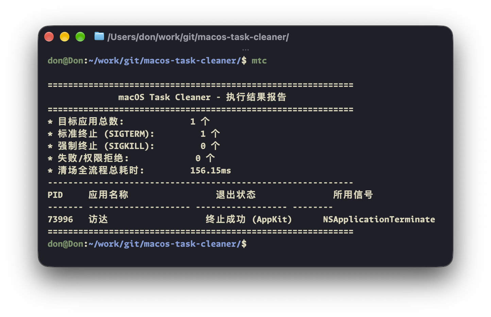

# macOS Task Cleaner

<p align="left">
  <a href="README.md">English</a> | <a href="README_ZH.md">简体中文</a>
</p>

<p align="left">
  <a href="https://apple.com/macos"></a>
  
  <a href="https://www.rust-lang.org/"></a>
  <a href="https://swift.org/"></a>
  <a href="https://brew.sh/"></a>
  <a href="LICENSE"></a>
  <a href="COMMERCIAL.md"></a>
</p>

面向 macOS 的高性能、非侵入式前台任务清理与进程管理工具集。由 Rust 编写的高精度核心引擎（`macos-task-cleaner-core`）、终端交互向导命令行工具（`mtc`）以及基于原生 SwiftUI/AppKit 开发的状态栏常驻应用（`TaskCleaner.app`）组成。

---

## 界面一览与视觉展示

### 双模态交互体验：原生状态栏面板与终端交互向导

| 原生状态栏常驻面板 (`TaskCleaner.app`) | 终端交互式向导 (`mtc -i`) |
| :---: | :---: |
|  |  |

### 自动化批量清场与诊断报告

| 分级进程终止与豁免评估报告 (`mtc --execute`) |
| :---: |
|  |

---

## 核心设计与技术亮点

* **非侵入式 POSIX 分级降级清场**：
  彻底绕过各类应用层阻塞式保存与确认弹窗，按序列平滑执行优雅退出协议（`SIGTERM` 软下线通知 -> 宽限期毫秒级轮询 -> `SIGKILL` 兜底强退）。
* **原生 AppKit 访达 (Finder) 优雅退出协议**：
  常规进程管理器向 Finder 发送 POSIX 信号时，`launchd` 守护进程会将其判定为非正常崩溃并立即将其重新拉起（造成“关一下闪退又瞬间弹回”的怪异现象）。Task Cleaner 通过调用原生 AppKit 的 `NSRunningApplication.terminate()` 通知系统，确保 Finder 实现真正的平稳自愿退出，杜绝反复自启。
* **四级白名单防御矩阵**：
  * **L1 系统核心层 (Core OS)**：保护 `Dock`、`WindowServer`、`SystemUIServer`、`ControlCenter`、`NotificationCenter`、`loginwindow` 等系统底层中枢，以及默认受保护的访达 (`Finder`)。
  * **L2 会话终端层 (Context Shell)**：自适应递归解析调用者进程树，自动豁免调用者 PID、父进程 PPID，以及常见开发终端与编辑器（`Terminal`、`Ghostty`、`iTerm2`、`Alacritty`、`VS Code` 等），防止误杀当前工作环境。
  * **L3 常驻设施层 (Persistent Utilities)**：智能识别并豁免 `Raycast`、`Alfred`、`Rectangle`、输入法（鼠须管、搜狗）与系统状态栏监控小组件。
  * **L4 用户配置层 (User Config & CLI)**：支持从 `~/.config/mtc/config.toml` 持久化加载自定义白名单规则（按 Bundle Identifier 或应用显示名），并支持命令行动态参数覆盖。
* **对标 macOS 实用工具原生质感**：
  严格遵循 Apple Human Interface Guidelines，采用深色监视器屏幕基底、微网格暗调背景、窗口高度自适应与微浮雕按钮，深度适配深浅外观模式，并内置 24 种语言的无缝自适应本地化。

---

## 项目组件与架构体系

本项目由三个高内聚、低耦合的核心模块构成：

* **[macos-task-cleaner-core](https://github.com/macos-task-cleaner/macos-task-cleaner-core)**：底层核心引擎库（Rust 开发）。基于 AppKit `NSWorkspace` 原生 API 精确扫描前台图形进程，提供多级白名单评估算法与 POSIX 信号生命周期调度。
* **[macos-task-cleaner-cli](https://github.com/macos-task-cleaner/macos-task-cleaner-cli) (`mtc`)**：命令行交互式客户端。支持终端向导（`mtc -i`）、静默清场（`--execute`）、预检预览（`--dry-run`）以及为 Raycast/自动化脚本适配的 `--json` 结构化输出。
* **[macos-task-cleaner-gui](https://github.com/macos-task-cleaner/macos-task-cleaner-gui) (`TaskCleaner.app`)**：状态栏常驻客户端。基于 Swift 与 SwiftUI 架构原生构建，轻量无额外运行时开销，具备状态栏徽标计数、单任务快速结束与一键批量清理能力。

---

## 快速安装与使用

### 方式一：通过 Homebrew 安装 (推荐)

添加官方 Tap 仓库并一键安装：

```bash
# 添加官方 Tap 软件源
brew tap macos-task-cleaner/tap

# 安装图形状态栏客户端 (内置完整命令行工具)
brew install --cask task-cleaner

# 或仅安装独立命令行工具
brew install mtc
```

### 方式二：下载预编译版本 (DMG / 压缩包)

从 GitHub Releases 页面直接下载预编译二进制：

* **图形客户端 (GUI)**：前往 [Task Cleaner GUI Releases](https://github.com/macos-task-cleaner/macos-task-cleaner-gui/releases/latest) 下载 `TaskCleaner-macOS-arm64.dmg` 或 `TaskCleaner-macOS-universal.dmg`，双击打开后拖拽至 `应用程序 (Applications)` 目录。
* **命令行客户端 (CLI)**：前往 [Task Cleaner CLI Releases](https://github.com/macos-task-cleaner/macos-task-cleaner-cli/releases/latest) 下载 `mtc-macos-arm64.tar.gz` 或 `mtc-macos-universal.tar.gz`，解压后放置于 `/usr/local/bin/` 或 `~/.local/bin/` 目录下。

### 方式三：源码编译安装

#### 编译图形客户端 (`TaskCleaner.app`)

要求 macOS 13.0+ 及 Swift 5.9+ / Xcode 环境：

```bash
git clone https://github.com/macos-task-cleaner/macos-task-cleaner-gui.git
cd macos-task-cleaner-gui

# 使用内置脚本编译并打包 Release 应用 (支持 arm64 / x86_64 / universal)
./scripts/build_app.sh

# 安装至应用程序目录
cp -R build/TaskCleaner.app /Applications/
open /Applications/TaskCleaner.app
```

#### 编译命令行工具 (`mtc`)

要求已安装 Rust 工具链（1.75+）：

```bash
git clone https://github.com/macos-task-cleaner/macos-task-cleaner-cli.git
cd macos-task-cleaner-cli

# 编译 Release 二进制文件
cargo build --release

# 安装主命令到可执行路径
cp target/release/mtc ~/.local/bin/
ln -sf ~/.local/bin/mtc ~/.local/bin/taskcleaner
```

---

## 详细使用指南

### 1. 终端交互式清场向导 (`mtc -i`)

运行纯键盘驱动的交互式控制台，实时查看所有前台进程状态、白名单豁免级别，并可灵活筛选、临时跳过或执行分级清理：

```bash
mtc -i
```

#### 交互式指令速查表

| 指令 | 语法示例 | 说明 |
| :--- | :--- | :--- |
| `w` | `w 2, 4` | 将指定序号的应用永久加入配置文件白名单 |
| `t` | `t 1` | 在本轮清场中临时跳过/豁免指定应用 |
| `c` / `clean` | `c` | 确认执行平滑清场（`SIGTERM` -> 宽限期轮询 -> `SIGKILL`） |
| `f` / `force` | `f` | 跳过宽限期直接强制秒杀所有未受保护的前台任务（`SIGKILL`） |
| `p` / `protected` | `p` | 查看当前受白名单保护的完整应用清单及对应保护层级 |
| `r` / `refresh` | `r` | 重新扫描系统活跃的前台应用 |
| `q` / `quit` | `q` | 安全退出向导，不执行任何变更 |

### 2. 命令行批量与自动化指令

```bash
# 预检预览模式 (仅扫描分析并打印报告，不结束任何进程)
mtc --dry-run

# 标准交互式清理 (清理前提示确认)
mtc

# 静默立即执行平滑清场 (适合脚本调用或定时任务)
mtc --execute

# 强制立即秒杀 (直接下发 SIGKILL)
mtc --force

# 结构化 JSON 格式输出 (适合接入 Raycast 插件、快捷指令或自动化工作流)
mtc --json --dry-run

# 一键将指定应用添加至持久化白名单
mtc -a "com.google.Chrome"

# 从持久化白名单中移除指定应用
mtc -r "com.google.Chrome"

# 查看当前生效的全部白名单规则
mtc --list-whitelist
```

### 3. 原生状态栏图形应用 (`TaskCleaner.app`)

* **状态栏数字徽标**：图标右上角实时显示当前正在运行的前台应用总数。
* **三段式清晰统计**：
  * **待清理**：统计当前命中清理范围、即将被退出的前台应用数量。
  * **已保护 / 白名单**：展示处于 L1 至 L4 各保护层级中的应用总数。
  * **活动应用总数**：展示当前系统所有前台图形应用总计。
* **精细化单任务控制**：
  * 点击任意应用右侧的**垃圾桶**图标，可单独结束该特定应用。
  * 点击任意应用右侧的**加锁/盾牌**图标，可一键将其加入或移除用户白名单。
* **一键全部清理**：点击底部的 **全部清理** 按钮，瞬时安全退出全部未加白的前台应用。
* **访达优雅退出**：当用户选择退出访达时，使用 AppKit 协议平稳退出，彻底避免被 `launchd` 强制复活。
* **多语言自动本地化**：自动跟随系统语言偏好无缝切换（支持 24 种语言）。

---

## 配置文件规范

配置文件默认位于 `~/.config/mtc/config.toml`（向前兼容 `~/.config/taskcleaner/config.toml`）：

```toml
[general]
# 宽限期轮询超时时长 (单位: 毫秒，默认 400ms)
grace_period_ms = 400

# 默认是否以 --dry-run 预检模式运行 (true: 仅扫描分析; false: 直接执行清理)
default_dry_run = false

[whitelist]
# 用户自定义白名单 - 按 Bundle Identifier 豁免 (精确度最高，推荐)
bundle_ids = [
    "com.google.Chrome",
    "com.spotify.client",
    "com.tencent.xinWeChat",
]

# 用户自定义白名单 - 按应用显示名称豁免
names = [
    "Telegram",
    "Slack",
    "MacVim",
]
```

---

## Rust 核心库接口调用示例

可在自有 Rust 项目的 `Cargo.toml` 中直接引用底层引擎：

```toml
[dependencies]
macos-task-cleaner-core = { git = "https://github.com/macos-task-cleaner/macos-task-cleaner-core" }
```

```rust
use std::time::Duration;
use macos_task_cleaner_core::{
    scan_foreground_apps,
    tiered_terminate,
    WhitelistManager,
};

fn main() {
    // 1. 初始化白名单管理器 (加载配置文件与 CLI 覆盖项)
    let (whitelist, _config) = WhitelistManager::new(None, &[]);

    // 2. 基于 AppKit NSWorkspace 扫描当前前台运行应用
    let apps = scan_foreground_apps();

    // 3. 过滤并排除受 L1 ~ L4 矩阵保护的应用
    let targets: Vec<_> = apps
        .into_iter()
        .filter(|app| whitelist.check_protection(app).is_none())
        .collect();

    // 4. 执行分级降级清理 (SIGTERM -> 400ms 宽限期轮询 -> SIGKILL 兜底)
    let report = tiered_terminate(&targets, Duration::from_millis(400), false);
    println!("清理完成: 成功结束 {} 个前台任务", report.terminated_sigterm + report.terminated_sigkill);
}
```

---

## 许可协议与商业授权

本项目采用双重授权模式（Dual-Licensing Model）：

1. **开源许可证**：遵循 **GNU Affero General Public License v3.0 (AGPLv3)** 协议。个人学习、学术研究与非商业开源项目可免费使用与修改；凡修改或基于本项目构建衍生作品（包括通过网络提供交互服务的 SaaS / 云端调用形态），均须向公众无偿开源全部衍生代码。详见 [LICENSE](LICENSE)。
2. **商业许可协议 (Commercial License)**：面向企业客户、闭源专有产品集成、白标重命名销售或无法遵守 AGPLv3 传染性条款的商业场景，必须事先取得商业授权许可证。详见 [COMMERCIAL.md](COMMERCIAL.md)。
3. **商标与品牌保护**：项目名称、标识图形与应用图标均受版权及商标保护。任何二次分发或分叉 (Fork) 版本必须彻底去除官方品牌元素。详见 [TRADEMARK.md](TRADEMARK.md)。

Copyright (c) 2026 DonJone. 保留所有权利。
