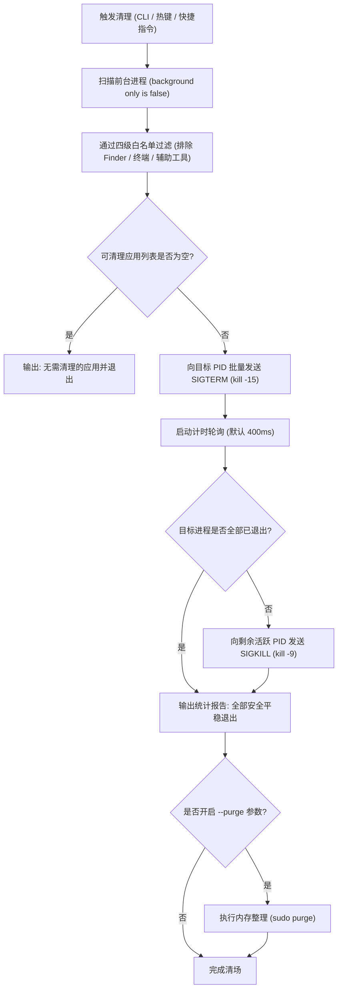

# macOS 任务清场工具 (macOS Task Cleaner) 工程需求文档

## 1. 项目背景与目标 (Background & Objectives)

### 1.1 业务背景
在移动端（如 Android），用户已建立高频的“划掉后台/一键清理”心智模型。当切换生活与工作状态、需要降低视觉干扰或释放硬件资源时，用户能够通过一个动作清空所有瞬态前台应用。
而在 macOS 桌面生态中：
* 应用采用窗口-进程分离模型，关闭红叉按钮（Red Close Button）仅关闭窗口，主进程依然驻留在 Dock 栏和内存中。
* 传统的应用退出（`Cmd + Q` 或 AppleEvent `Quit`）会依赖应用的事件循环，频繁触发诸如“是否保存草稿”、“是否确认关闭所有标签页”等阻塞性对话框，破坏了“一按即走”的清爽感与确定性。
* 现代桌面办公充斥着大量的 Electron 跨平台应用与 Chromium 实例，长久后台驻留导致大量内存占用和能耗损耗。

### 1.2 核心目标
设计并构建一个面向 macOS 的轻量级、工程级**任务清场工具 (Task Cleaner)**，提供等同于 Android“清理后台”的清爽体验：
1. **零阻碍执行（Zero-Dialog Frictionless）**：完全绕过 UI 层的确认拦截，实现免弹窗瞬间清理。
2. **渐进式安全（Tiered Termination）**：避免粗暴 `kill -9` 导致应用配置文件写坏或数据库锁死，采用 POSIX 级信号平滑降级机制。
3. **精准防御（Strict Whitelisting）**：建立多层白名单机制，严格保护系统底座、输入法、辅助效率工具和用户关键上下文。
4. **多端交互支持**：支持终端 CLI、全局快捷键、Raycast 脚本及原生快捷指令无缝调用。

---

## 2. 核心功能需求 (Functional Requirements)

### 2.1 FR-1: 前台应用自适应扫描与判定
* **目标界定**：仅针对“前台图形界面应用”（在 Dock 栏显示、在 `Cmd + Tab` 切换器可见的 App）。
* **排除隐式进程**：严格排除 `background only is true` 的纯后台 Daemon、Launchd 托管代理、Helper 辅助子进程与系统服务。
* **双模定位**：支持根据“进程显示名称 (Process Name)”与“应用唯一包名 (Bundle Identifier)”双重识别，确保跨系统语言版本的稳定性。

### 2.2 FR-2: 免弹窗静默终止 (Bypass UI Dialogs)
* **核心机制**：终止指令不得通过 AppleEvents 发送高级应用层 `Quit` 消息，必须在操作系统内核/信号层处理。
* **静默要求**：在处理未保存草稿、多标签页退出、正在下载提示等场景时，一律不得在屏幕上挂起任何确认窗口，保证调用者瞬间返回。

### 2.3 FR-3: 三段式分级降级终止算法 (Tiered Termination Strategy)
* **阶段一：软信号优雅通知 (SIGTERM / kill -15)**
  * 向目标进程发送 `SIGTERM` 信号。
  * 效果：操作系统通知进程准备终止。绝大多数应用会触发底层的 `atexit` 句柄，正常回写未损坏的磁盘数据、释放文件句柄并直接下线，且**无法呼出 UI 弹窗**。
* **阶段二：宽限期轮询 (Grace Period Polling)**
  * 设置可配置的超时窗口（默认 300ms ~ 500ms）。
  * 周期性通过信号 0 轮询被标记进程的活跃状态。
* **阶段三：硬信号兜底抹除 (SIGKILL / kill -9)**
  * 对于在超时窗口内依然处于阻塞、死锁或无响应的顽固进程，发送 `SIGKILL` 强行回收。

### 2.4 FR-4: 四级白名单与防误杀过滤网
建立结构化的白名单过滤矩阵，任何匹配白名单规则的进程必须被无条件忽略：

| 白名单层级 | 典型进程/规则 | 保护目的 |
| :--- | :--- | :--- |
| **L1: 系统核心层 (Core OS)** | Finder, Dock, WindowServer, SystemUIServer, loginwindow | 防止桌面崩溃、桌面图标重置或注销登录 |
| **L2: 当前上下文层 (Context Shell)** | Terminal, iTerm2, Alacritty, Ghostty, wezterm-gui, tmux, 调起工具自身 | 防止把正在执行清理动作的终端或 IDE 自身杀掉 |
| **L3: 常驻效率与基础设施 (Persistent Utilities)** | 输入法(Rime, Sogou), Raycast, Alfred, 窗口管理(Rectangle, Yabai), 状态栏监控(Stats, Bartender) | 这些工具虽然拥有 UI，但属于桌面环境基础设施，重启成本极高 |
| **L4: 用户自定义业务保留 (User Preferences)** | 音乐播放器(Music, Spotify)、下载工具、通信工具等 | 用户可配置自定义保留列表 |

### 2.5 FR-5: 资源回收与状态整理 (Memory Reclamation)
* **可选内存回笼**：在批量终止进程后，支持可选参数（如 `--purge`），调用系统内核级 `purge` 命令，主动强制回收 inactive 页面和已销毁进程的残留缓存。

### 2.6 FR-6: 审计与试运行机制 (Dry-Run & Audit)
* **预检模式 (`--dry-run`)**：在不实际触发任何杀进程操作的前提下，输出当前系统中满足清场条件的应用清单及 PID，便于用户调试白名单。
* **清场报告**：执行完成后输出结构化结果（成功终止的应用数量、耗时、通过 SIGTERM 退出的数量、触发 SIGKILL 兜底的数量）。

---

## 3. 非功能性需求 (Non-Functional Requirements)

### 3.1 性能指标 (Performance)
* **执行时延**：整个清场过程（包括进程扫描、信号发送与状态确认）必须在 **1000ms** 以内完成。
* **CPU/内存占用**：扫描与信号派发程序运行时的自身资源消耗可忽略不计（执行期内存占用 < 10MB）。

### 3.2 鲁棒性与系统安全性 (Safety & Reliability)
* **配置防损**：优先通过 SIGTERM 退出，避免粗暴清杀导致 `NSUserDefaults` 写入中断为 0 字节。
* **权限安全**：默认仅在当前登录用户空间操作，无需提升为 root/sudo 权限即可清理用户空间的所有 GUI 应用。

### 3.3 技术栈约束、便携性与零运行时依赖 (Tech Stack & Zero Runtime Dependencies)
* **核心技术栈**：采用 Rust 语言开发，直接通过 FFI 绑定 macOS 原生系统级库（`AppKit`、`Foundation`、`libSystem`）与底层 POSIX 系统调用，保障高精度进程识别、微秒级响应与类型安全。
* **零运行时外部依赖 (Zero Runtime Dependencies)**：交付产物为单一独立的 Mach-O 原生二进制程序。目标设备无需预装 Rust 工具链、Python 运行时、Node.js 或任何第三方动态库，即放即用。
* **跨架构兼容性 (Universal Binary)**：支持 Apple Silicon (`aarch64-apple-darwin`) 与 Intel (`x86_64-apple-darwin`) 双架构通用二进制分发，保障全机型开箱即用。

---

## 4. 系统技术架构与流程设计 (Technical Architecture)

### 4.1 终止流程时序图



### 4.2 核心过滤逻辑伪代码规范

```text
Input: RunningProcesses, WhitelistNames, WhitelistBundleIDs
Output: TargetsToKill

TargetsToKill = []
for process in RunningProcesses:
    if process.isBackgroundOnly == true:
        continue
    if process.name in WhitelistNames:
        continue
    if process.bundleID in WhitelistBundleIDs:
        continue
    if process.pid == CurrentProcess.pid or process.pid == ParentProcess.pid:
        continue
    TargetsToKill.append(process)

return TargetsToKill
```

---

## 5. 交互形态与部署接口 (Interface & Delivery Options)

### 5.1 交付形态 A：核心 CLI 原生二进制 (`taskcleaner`)
作为底层执行引擎，采用 Rust 编译生成，部署在工作目录或 `~/.local/bin/`：
* `taskcleaner`：标准静默清理，执行三段式清场，无任何弹窗。
* `taskcleaner -n` 或 `--dry-run`：列出将被清理的应用，不执行实质动作。
* `taskcleaner -f` 或 `--force`：跳过 400ms 宽限期，直接秒杀（纯 SIGKILL）。
* `taskcleaner -p` 或 `--purge`：清理后自动回收内存缓存。
* `taskcleaner -k <name>`：临时追加白名单。

### 5.2 交付形态 B：系统全局热键与快捷指令
* 利用 macOS 快捷指令 (Shortcuts) 或 Automator 封装 CLI 二进制调用。
* 支持在系统设置中绑定全局快捷键（例如 `Control + Option + Command + Q`），按键触发瞬间重置工作台。

### 5.3 交付形态 C：Raycast Script Command
* 编写 Raycast Metadata 脚本，通过输入 `clean` 关键词直接回车唤起，并在 Raycast HUD 中以一行小字展示清理结果（如：“已清理 7 个应用，释放 2.4GB 资源”）。

---

## 6. 风险评估与防御策略 (Risk Matrix)

| 潜在风险 | 风险等级 | 防御策略 |
| :--- | :--- | :--- |
| **未保存文档数据丢失** | 中 | 本工具属于“主动断舍离”操作。文档中明确告知用户：未开启自动保存的文档会丢失最近修改，建议配合各编辑器的 Autosave 机制使用。 |
| **意外杀死状态栏后台助手** | 低 | 采用 `background only is false` 双重判定，状态栏纯驻留工具原生属于 background helper，默认自动豁免。 |
| **终端会话被意外截断** | 高 | 强校验机制，自适应获取当前终端的 `$PPID` 及终端宿主进程名（Terminal, iTerm2 等），加入硬编码强制保护。 |

---

## 7. 实施里程碑计划 (Milestones)

* **阶段 1 (原型验证)**：完成基于 Rust 的核心前台扫描与 POSIX 信号三段式原型开发，验证各种主流前台 App（Chrome, VSCode, Slack, WeChat, Office）在 SIGTERM 下的表现。
* **阶段 2 (白名单持久化与配置)**：支持 `~/.config/taskcleaner/config.toml`（或 `whitelist.conf`）外部配置文件，允许用户自由扩展白名单与调整超时参数。
* **阶段 3 (工作流打通)**：编写 Automator QuickAction、Raycast Script Command 及快捷指令元数据模板，实现一键式快捷键安装与状态上报。
